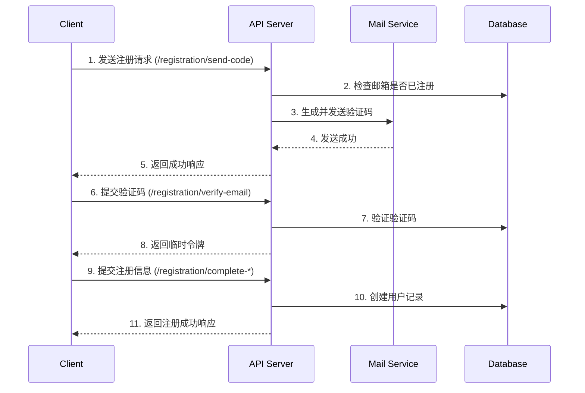

# 项目文档

## 项目概述

这是一个基于 NestJS 框架构建的后端API项目，实现了完整的用户认证、授权、邮件服务、缓存管理等功能。项目采用模块化架构设计，使用 Prisma 作为 ORM 工具，支持多种存储和消息队列服务。

## 技术栈

- **核心框架**: NestJS v11
- **数据库**: PostgreSQL (通过 Prisma ORM)
- **缓存**: Redis
- **认证**: JWT, Passport
- **权限控制**: CASL
- **API 文档**: Swagger
- **日志**: Pino
- **任务调度**: @nestjs/schedule
- **邮件服务**: @nestjs-modules/mailer
- **国际化**: nestjs-i18n
- **测试**: Jest

## 项目结构

```
src/
├── auth/               # 认证相关模块
├── cache/              # 缓存管理
├── casl/               # 权限控制
├── common/             # 通用工具和装饰器
├── config/             # 配置文件
├── i18n/               # 国际化资源
├── locations/          # 地理位置相关
├── mail/               # 邮件模板和配置
├── prisma/             # 数据库模型和迁移
├── schedule-tasks/     # 定时任务
├── user/               # 用户管理
└── utils/              # 工具函数
```

## 功能特性

### API 文档

#### 1. 认证相关 API

##### 1.1 用户注册

###### 零售商注册流程

1. **发送注册验证码**
   ```http
   POST /registration/send-code
   Content-Type: application/json
   
   {
     "email": "retailer@example.com",
     "language": "zh-CN",
     "timezone": "Asia/Shanghai"
   }
   ```
   - **功能**：发送注册验证码到用户邮箱
   - **频率限制**：60秒内最多3次
   - **响应**：
     ```json
     {
       "success": true,
       "message": "验证码已发送"
     }
     ```

2. **验证邮箱验证码**
   ```http
   POST /registration/verify-email
   Content-Type: application/json
   
   {
     "email": "retailer@example.com",
     "code": "123456"
   }
   ```
   - **功能**：验证邮箱验证码并返回临时令牌
   - **响应**：
     ```json
     {
       "success": true,
       "tempToken": "eyJhbGciOiJIUzI1NiIsInR5cCI6IkpXVCJ9..."
     }
     ```

3. **完成注册**
   ```http
   POST /registration/complete-retailer
   Content-Type: application/json
   Authorization: Bearer <tempToken>
   
   {
     "password": "SecurePass123!",
     "confirmPassword": "SecurePass123!",
     "profile": {
       "firstName": "张",
       "lastName": "三",
       "phoneNumber": "+8613812345678"
     },
     "addresses": [{
       "type": "STORE",
       "street": "上海市浦东新区张江高科技园区",
       "cityId": 1,
       "postalCode": "201203",
       "isDefault": true
     }]
   }
   ```
   - **功能**：完成零售商注册
   - **密码要求**：
     - 至少8个字符
     - 包含大小写字母
     - 包含数字
     - 包含特殊字符
   - **响应**：
     ```json
     {
       "id": "550e8400-e29b-41d4-a716-446655440000",
       "email": "retailer@example.com",
       "role": "RETAILER",
       "status": "ACTIVE"
     }
     ```

## 2. 用户认证 API

### 2.1 用户登录

#### 2.1.1 标准登录 (Standard Login)

```http
POST /login/standard
Content-Type: application/json

{
  "email": "user@example.com",
  "password": "StrongPassword123!",
  "deviceName": "CHROME_BROWSER",
  "userAgent": "Mozilla/5.0 (Windows NT 10.0; Win64; x64) AppleWebKit/537.36"
}
```

**功能**: 通过邮箱和密码进行标准登录，获取访问令牌和刷新令牌。

**请求头**:
- `Content-Type: application/json`

**请求参数 (Body)**:
| 参数名 | 类型 | 必填 | 描述 | 示例 |
|--------|------|------|------|------|
| email | string | 是 | 用户注册邮箱 | user@example.com |
| password | string | 是 | 用户密码（6位以上，需包含大小写字母和数字） | StrongPassword123! |
| deviceName | string | 是 | 设备名称，将转换为大写 | CHROME_BROWSER |
| userAgent | string | 是 | 用户代理信息，用于设备识别 | Mozilla/5.0 (Windows NT 10.0; Win64; x64) |

**成功响应 (200 OK)**:
```json
{
  "accessToken": "eyJhbGciOiJIUzI1NiIsInR5cCI6IkpXVCJ9...",
  "refreshToken": "eyJhbGciOiJIUzI1NiIsInR5cCI6IkpXVCJ9...",
  "expiresIn": 3600,
  "tokenType": "Bearer"
}
```

**错误响应**:
- 400: 请求参数无效
- 401: 用户名或密码错误
- 403: 账户被锁定或禁用
- 429: 登录尝试次数过多

**安全措施**:
- 密码加盐哈希存储
- 登录失败次数限制（3次）
- 账户锁定机制
- 设备指纹验证
- JWT 令牌签名验证

**日志记录**:
- 登录成功/失败事件
- 设备信息和IP地址
- 会话创建和更新

#### 2.1.2 Web 登录 (Web Login)

```http
POST /login/web
Content-Type: application/json

{
  "email": "user@example.com",
  "password": "StrongPassword123!",
  "deviceName": "CHROME_BROWSER",
  "userAgent": "Mozilla/5.0 (Windows NT 10.0; Win64; x64)"
}
```

**功能**: 专为Web应用设计的登录接口，自动设置HTTP-only的刷新令牌cookie。

**响应头**:
- `Set-Cookie`: 包含HTTP-only的刷新令牌

**成功响应 (200 OK)**:
```json
{
  "accessToken": "eyJhbGciOiJIUzI1NiIsInR5cCI6IkpXVCJ9...",
  "expiresIn": 3600,
  "tokenType": "Bearer"
}
```

**安全特性**:
- 刷新令牌通过HTTP-only Cookie传输
- 启用Secure和SameSite属性
- 防止CSRF攻击

#### 2.1.3 登录流程说明

1. **凭证验证**
   - 验证邮箱格式和密码强度
   - 检查账户状态（激活/禁用/锁定）
   - 验证密码哈希

2. **会话管理**
   - 生成唯一会话ID
   - 创建设备指纹（基于userAgent）
   - 更新最后登录时间
   - 管理并发会话

3. **令牌生成**
   - 访问令牌 (Access Token): 1小时有效期
   - 刷新令牌 (Refresh Token): 7天有效期
   - 包含用户角色和权限信息

4. **安全审计**
   - 记录登录IP和设备信息
   - 监控异常登录行为
   - 支持会话撤销

#### 2.1.4 错误处理

| 错误码 | HTTP 状态码 | 描述 | 解决方案 |
|--------|------------|------|---------|
| AUTH.INVALID_CREDENTIALS | 400 | 无效的凭据 | 检查邮箱和密码 |
| AUTH.ACCOUNT_DISABLED | 403 | 账户被禁用 | 联系管理员 |
| AUTH.ACCOUNT_LOCKED | 403 | 账户被锁定 | 等待自动解锁或联系管理员 |
| AUTH.TOO_MANY_ATTEMPTS | 429 | 登录尝试次数过多 | 稍后重试 |
| AUTH.USER_NOT_FOUND | 401 | 用户不存在 | 检查邮箱或注册新账户 |
| AUTH.INVALID_PASSWORD | 401 | 密码错误 | 检查密码或使用忘记密码功能 |

#### 2.1.5 最佳实践

1. **令牌存储**
   - 访问令牌：内存或短期存储
   - 刷新令牌：安全HTTP-only Cookie（Web）或安全存储（移动端）
   - 避免本地存储敏感信息

2. **错误处理**
   - 显示用户友好的错误消息
   - 记录详细的调试信息
   - 实现指数退避重试机制

3. **安全建议**
   - 使用HTTPS传输
   - 实现双因素认证
   - 定期轮换刷新令牌
   - 监控异常登录行为

4. **会话管理**
   - 提供登出功能
   - 支持查看和管理活动会话
   - 实现会话超时控制

###### 1.2.1 登录流程

```http
POST /auth/login
Content-Type: application/json

{
  "email": "user@example.com",
  "password": "SecurePass123!",
  "deviceName": "iPhone 13",
  "userAgent": "Mozilla/5.0 (iPhone; CPU iPhone OS 15_0 like Mac OS X) AppleWebKit/605.1.15"
}
```

- **功能**：用户登录并获取访问令牌
- **请求参数**：
  - `email` (string, 必填): 用户邮箱
  - `password` (string, 必填): 用户密码
  - `deviceName` (string, 必填): 设备名称
  - `userAgent` (string, 必填): 用户代理信息

- **成功响应 (200 OK)**:
  ```json
  {
    "accessToken": "eyJhbGciOiJIUzI1NiIsInR5cCI6IkpXVCJ9...",
    "refreshToken": "eyJhbGciOiJIUzI1NiIsInR5cCI6IkpXVCJ9...",
    "expiresIn": 3600,
    "tokenType": "Bearer"
  }
  ```

- **错误响应**:
  - 400: 请求参数无效
  - 401: 用户名或密码错误
  - 403: 账户被禁用
  - 429: 登录尝试次数过多

###### 1.2.2 登录流程说明

1. **凭证验证**
   - 验证邮箱和密码格式
   - 检查用户是否存在
   - 验证密码哈希
   - 检查账户状态

2. **会话管理**
   - 生成唯一的会话ID
   - 创建设备指纹（基于userAgent）
   - 记录登录设备信息
   - 更新最后登录时间

3. **令牌生成**
   - 访问令牌 (Access Token): 短期有效（默认1小时）
   - 刷新令牌 (Refresh Token): 长期有效（默认7天）
   - 包含用户信息和权限范围

4. **安全措施**
   - 密码加盐哈希存储
   - 登录失败次数限制
   - 可疑登录检测
   - 会话管理
   - 设备指纹验证

5. **会话存储**
   - 会话信息存储在Redis中
   - 包含用户ID、设备信息、登录时间等
   - 支持会话管理和撤销

###### 1.2.3 登录状态码说明

| 状态码 | 错误码 | 描述 |
|--------|--------|------|
| 200 | - | 登录成功 |
| 400 | AUTH.INVALID_CREDENTIALS | 无效的凭据 |
| 401 | AUTH.ACCOUNT_DISABLED | 账户被禁用 |
| 401 | AUTH.INVALID_PASSWORD | 密码错误 |
| 401 | AUTH.USER_NOT_FOUND | 用户不存在 |
| 429 | AUTH.TOO_MANY_ATTEMPTS | 登录尝试次数过多 |

###### 1.2.4 安全建议

1. **密码安全**
   - 使用强密码策略
   - 定期更新密码
   - 不与其他网站使用相同密码

2. **会话安全**
   - 不要分享访问令牌
   - 使用HTTPS传输
   - 定期轮换刷新令牌

3. **设备安全**
   - 仅登录可信设备
   - 及时登出不使用的设备
   - 关注异常登录提醒

##### 1.3 令牌刷新

###### 1.3.1 刷新令牌流程

```http
POST /auth/refresh-token
Content-Type: application/json

{
  "refreshToken": "eyJhbGciOiJIUzI1NiIsInR5cCI6IkpXVCJ9..."
}
```

- **功能**：使用刷新令牌获取新的访问令牌
- **请求头**：
  - `Content-Type: application/json`
  - `Authorization: Bearer <current_access_token>` (可选，如果可用)

- **请求参数**：
  - `refreshToken` (string, 必填): 之前获取的刷新令牌

- **成功响应 (200 OK)**:
  ```json
  {
    "accessToken": "new.access.token.here",
    "refreshToken": "new.refresh.token.here",
    "expiresIn": 3600,
    "tokenType": "Bearer"
  }
  ```

- **错误响应**:
  - 400: 无效的刷新令牌
  - 401: 刷新令牌已过期或无效
  - 403: 刷新令牌已被撤销
  - 404: 关联的会话不存在

###### 1.3.2 刷新令牌流程说明

1. **令牌验证**
   - 验证刷新令牌签名
   - 检查令牌是否过期
   - 验证令牌是否被撤销
   - 确认关联的会话状态

2. **令牌轮换**
   - 生成新的访问令牌
   - 可选：生成新的刷新令牌（滑动过期）
   - 更新令牌过期时间
   - 记录令牌使用情况

3. **安全措施**
   - 刷新令牌单次使用
   - 令牌绑定到特定设备和会话
   - 检测可疑的刷新请求
   - 支持令牌撤销

4. **会话管理**
   - 更新会话最后活动时间
   - 记录令牌刷新历史
   - 支持会话超时控制

###### 1.3.3 刷新令牌状态码说明

| 状态码 | 错误码 | 描述 |
|--------|--------|------|
| 200 | - | 令牌刷新成功 |
| 400 | AUTH.INVALID_REFRESH_TOKEN | 无效的刷新令牌 |
| 401 | AUTH.EXPIRED_REFRESH_TOKEN | 刷新令牌已过期 |
| 403 | AUTH.REVOKED_TOKEN | 刷新令牌已被撤销 |
| 404 | AUTH.SESSION_NOT_FOUND | 关联的会话不存在 |

###### 1.3.4 安全最佳实践

1. **令牌存储**
   - 访问令牌：内存或短期存储
   - 刷新令牌：安全HTTP-only Cookie
   - 避免本地存储敏感令牌

2. **令牌轮换**
   - 每次刷新都生成新的刷新令牌
   - 使旧的刷新令牌失效
   - 限制刷新令牌的使用频率

3. **会话监控**
   - 记录所有令牌使用情况
   - 监控异常刷新模式
   - 支持远程会话终止

4. **撤销机制**
   - 支持撤销单个会话
   - 支持撤销用户所有会话
   - 支持紧急撤销所有令牌

5. **过期策略**
   - 访问令牌：短期（1-24小时）
   - 刷新令牌：中长期（7-30天）
   - 会话空闲超时：可配置（默认30天）

6. **安全头信息**
   - 设置适当的CORS策略
   - 启用HSTS
   - 设置安全相关的HTTP头
   - 实施CSRF保护

## 实现细节

### 1. 注册流程实现

#### 1.1 注册流程时序图



#### 1.2 安全措施

- **验证码保护**：
  - 6位数字验证码
  - 5分钟有效期
  - 最大尝试次数限制
  - 防暴力破解保护
  
- **密码安全**：
  - 使用 bcrypt 进行密码哈希
  - 密码强度要求
  - 密码历史记录
  
### API 文档

#### 1. 认证相关 API

##### 1.1 用户注册

###### 1.1.1 零售商注册流程

**概述**：
零售商注册采用三步骤流程：1) 发送验证码 2) 验证邮箱 3) 完成注册。每个步骤都有相应的安全措施和验证。

1. **发送注册验证码**
   ```http
   POST /registration/retailer
   Content-Type: application/json
   
   {
     "email": "retailer@example.com",
     "language": "es-ES",
     "timezone": "Europe/Madrid",
     "deepLink": "myapp://register/verification"
   }
   ```
   - **功能**：开始零售商注册流程，发送验证码到用户邮箱
   - **频率限制**：1次/分钟
   - **请求参数**：
     - `email` (string, 必填): 用户邮箱地址
     - `language` (string, 必填): BCP-47格式的语言代码 (如: es-ES, en-US, zh-CN)
     - `timezone` (string, 必填): IANA时区 (如: Europe/Madrid, Asia/Shanghai)
     - `deepLink` (string, 可选): 移动应用深度链接，用于验证后重定向
   - **成功响应 (200 OK)**:
     ```json
     {
       "message": "Verification code sent"
     }
     ```
   - **错误响应**:
     - 400: 请求参数无效
     - 409: 邮箱已注册
     - 429: 请求过于频繁

2. **验证邮箱验证码**
   ```http
   POST /registration/verify-email
   Content-Type: application/json
   
   {
     "email": "retailer@example.com",
     "code": "123456"
   }
   ```
   - **功能**：验证用户输入的验证码
   - **频率限制**：60秒内最多3次尝试
   - **请求参数**:
     - `email` (string, 必填): 用户邮箱地址
     - `code` (string, 必填): 6位数字验证码
   - **成功响应 (200 OK)**:
     ```json
     {
       "token": "eyJhbGciOiJIUzI1NiIsInR5cCI6IkpXVCJ9...",
       "expires_in": 900
     }
     ```
   - **错误响应**:
     - 400: 请求参数无效
     - 401: 验证码错误
     - 404: 验证码不存在或已过期
     - 429: 尝试次数过多，验证码已锁定

3. **完成注册**
   ```http
   POST /registration/retailer/complete
   Content-Type: application/json
   Authorization: Bearer <verification_token>
   
   {
     "email": "retailer@example.com",
     "password": "SecurePass123!",
     "username": "retailer123",
     "firstName": "张",
     "lastName": "三",
     "phone": "+34600123456",
     "verification_id": "verification_session_id",
     "token": "verification_token",
     "address": {
       "country": "ES",
       "province": 28,
       "city": 28079,
       "street": "Calle Falsa 123",
       "postalCode": "28001",
       "latitude": 40.4168,
       "longitude": -3.7038
     }
   }
   ```
   - **功能**：完成零售商账户注册
   - **请求头**:
     - `Authorization: Bearer <verification_token>`: 上一步获取的验证令牌
   - **请求参数**:
     - `email` (string, 必填): 用户邮箱地址
     - `password` (string, 必填): 密码（6位以上，包含大小写和数字）
     - `username` (string, 可选): 用户名（3-30字符，不能包含@）
     - `firstName` (string, 可选): 名字
     - `lastName` (string, 可选): 姓氏
     - `phone` (string, 可选): 电话号码（国际格式）
     - `verification_id` (string, 必填): 验证会话ID
     - `token` (string, 必填): 验证令牌
     - `address` (object, 必填): 地址信息
       - `country` (string): 国家代码 (ISO 3166-1 alpha-2)
       - `province` (number): 省份ID
       - `city` (number): 城市ID
       - `street` (string): 街道地址
       - `postalCode` (string): 邮政编码
       - `latitude` (number, 可选): 纬度
       - `longitude` (number, 可选): 经度
   - **成功响应 (200 OK)**:
     ```json
     {
       "id": "550e8400-e29b-41d4-a716-446655440000",
       "email": "retailer@example.com",
       "role": "RETAILER",
       "status": "INACTIVE",
       "createdAt": "2025-10-04T12:00:00Z"
     }
     ```
   - **错误响应**:
     - 400: 请求参数无效
     - 401: 验证令牌无效或已过期
     - 404: 用户不存在或已完成注册
     - 409: 用户名或邮箱已存在

###### 1.1.2 批发商注册流程

批发商注册流程与零售商类似，但需要额外的企业信息验证。主要区别在于：

1. 注册端点：`POST /registration/wholesaler`
2. 完成注册端点：`POST /registration/wholesaler/complete`
3. 需要额外提供企业信息：
   - 公司名称
   - 税号 (VAT/NIF)
   - 营业执照信息
   - 企业联系人信息

###### 1.1.3 数据模型

**用户模型 (User)**
```typescript
{
  id: string;                // 用户唯一标识
  email: string;             // 邮箱地址（唯一）
  username: string;          // 用户名（可选）
  firstName: string;         // 名字
  lastName: string;          // 姓氏
  phone: string;             // 电话号码
  role: UserRole;            // 用户角色 (RETAILER, WHOLESALER, ADMIN)
  status: UserStatus;        // 用户状态 (PENDING_VERIFICATION, ACTIVE, INACTIVE, SUSPENDED)
  password: string;          // 密码哈希
  lastLogin: Date;           // 最后登录时间
  createdAt: Date;           // 创建时间
  updatedAt: Date;           // 最后更新时间
  configurations: {          // 用户配置
    language: string;        // 语言偏好 (BCP-47)
    timezone: string;        // 时区 (IANA)
  };
  directions: Address[];     // 地址信息
}
```

**地址模型 (Address)**
```typescript
{
  id: string;                // 地址ID
  type: AddressType;         // 地址类型 (STORE, DELIVERY, BILLING)
  country: string;           // 国家代码 (ISO 3166-1 alpha-2)
  province: number;          // 省份ID
  city: number;             // 城市ID
  street: string;           // 街道地址
  postalCode: string;       // 邮政编码
  latitude: number;         // 纬度
  longitude: number;        // 经度
  isDefault: boolean;       // 是否默认地址
}
```

###### 1.1.4 安全措施

1. **验证码保护**：
   - 6位数字验证码，15分钟有效
   - 3次尝试失败后自动失效
   - 1分钟内只能请求1次验证码
   - 验证码存储在Redis中，自动过期
   - 防止验证码暴力破解

2. **密码安全**：
   - 最小长度6个字符
   - 必须包含大小写字母和数字
   - 使用bcrypt进行密码哈希存储（工作因子10）
   - 密码历史记录（防止重复使用）
   - 密码修改后强制重新登录

3. **会话管理**：
   - 验证令牌15分钟有效
   - 使用JWT进行身份验证
   - 刷新令牌7天有效
   - 令牌黑名单机制
   - 会话监控和异常检测

4. **数据验证**：
   - 邮箱格式和域名验证
   - 密码强度验证
   - 地址信息验证（国家、省份、城市级联）
   - 输入数据清理和转义
   - 防止SQL注入和XSS攻击

5. **防滥用机制**：
   - 请求频率限制（基于IP和用户）
   - 验证码尝试次数限制
   - 可疑活动监控和告警
   - 自动封禁恶意IP

###### 1.1.5 错误处理

**通用错误格式**
```json
{
  "statusCode": 400,
  "error": "Bad Request",
  "message": "Invalid request parameters",
  "errors": [
    {
      "field": "email",
      "message": "Invalid email format"
    }
  ]
}
```

**常见错误码**
- `40001`: 请求参数无效
- `40101`: 未授权访问
- `40102`: 验证码错误
- `40301`: 权限不足
- `40401`: 用户不存在
- `40901`: 邮箱已注册
- `42901`: 请求过于频繁
- `50001`: 服务器内部错误

###### 1.1.6 国际化支持

注册流程支持多语言，包括：
- 错误消息
- 验证提示
- 邮件模板
- 界面文本

支持的语言在 `src/i18n` 目录下配置，默认支持：
- 中文 (zh-CN)
- 英文 (en-US)
- 西班牙语 (es-ES)

###### 1.1.7 数据库表结构

**users 表**
```sql
CREATE TABLE users (
  id UUID PRIMARY KEY DEFAULT uuid_generate_v4(),
  email VARCHAR(100) UNIQUE NOT NULL,
  username VARCHAR(30) UNIQUE,
  first_name VARCHAR(50),
  last_name VARCHAR(60),
  phone VARCHAR(20),
  password_hash VARCHAR(100) NOT NULL,
  role VARCHAR(20) NOT NULL,
  status VARCHAR(20) NOT NULL DEFAULT 'PENDING_VERIFICATION',
  last_login TIMESTAMP WITH TIME ZONE,
  created_at TIMESTAMP WITH TIME ZONE NOT NULL DEFAULT NOW(),
  updated_at TIMESTAMP WITH TIME ZONE NOT NULL DEFAULT NOW(),
  deleted_at TIMESTAMP WITH TIME ZONE
);

CREATE INDEX idx_users_email ON users(email);
CREATE INDEX idx_users_username ON users(username);
CREATE INDEX idx_users_status ON users(status);
```

**user_configurations 表**
```sql
CREATE TABLE user_configurations (
  user_id UUID PRIMARY KEY REFERENCES users(id) ON DELETE CASCADE,
  language VARCHAR(15) NOT NULL DEFAULT 'es-ES',
  timezone VARCHAR(50) NOT NULL DEFAULT 'Europe/Madrid',
  created_at TIMESTAMP WITH TIME ZONE NOT NULL DEFAULT NOW(),
  updated_at TIMESTAMP WITH TIME ZONE NOT NULL DEFAULT NOW()
);
```

**addresses 表**
```sql
CREATE TABLE addresses (
  id UUID PRIMARY KEY DEFAULT uuid_generate_v4(),
  user_id UUID NOT NULL REFERENCES users(id) ON DELETE CASCADE,
  type VARCHAR(20) NOT NULL,
  country_iso CHAR(2) NOT NULL,
  province_id INTEGER,
  city_id INTEGER,
  street TEXT NOT NULL,
  postal_code VARCHAR(20),
  latitude DECIMAL(10, 8),
  longitude DECIMAL(11, 8),
  is_default BOOLEAN NOT NULL DEFAULT false,
  created_at TIMESTAMP WITH TIME ZONE NOT NULL DEFAULT NOW(),
  updated_at TIMESTAMP WITH TIME ZONE NOT NULL DEFAULT NOW()
);

CREATE INDEX idx_addresses_user_id ON addresses(user_id);
CREATE INDEX idx_addresses_type ON addresses(type);
```

###### 1.1.8 注册流程时序图

```mermaid
sequenceDiagram
    participant C as Client
    participant A as API Gateway
    participant S as Auth Service
    participant V as Verification Service
    participant D as Database
    participant M as Mail Service
    
    C->>+A: POST /registration/retailer
    A->>+S: 开始注册流程
    S->>+D: 检查邮箱是否已存在
    D-->>-S: 返回用户状态
    
    alt 新用户
        S->>+D: 创建待验证用户
        D-->>-S: 返回用户ID
    else 已存在但未验证
        S->>+D: 更新用户信息
        D-->>-S: 确认更新
    else 已存在且已验证
        S-->>-A: 返回409冲突
        A-->>-C: 409 邮箱已注册
    end
    
    S->>+V: 生成验证码
    V->>+D: 存储验证码(Redis)
    D-->>-V: 确认存储
    V-->>-S: 返回验证码ID
    
    S->>+M: 发送验证邮件
    M-->>-S: 邮件发送确认
    S-->>-A: 返回成功响应
    A-->>-C: 200 验证码已发送
    
    C->>+A: POST /registration/verify-email
    A->>+S: 验证验证码
    S->>+V: 验证验证码
    V->>+D: 获取并验证验证码
    D-->>-V: 返回验证结果
    V-->>-S: 返回验证结果
    
    alt 验证成功
        S->>+V: 生成验证令牌
        V-->>-S: 返回令牌
        S-->>-A: 返回令牌
        A-->>-C: 200 验证成功
    else 验证失败
        S-->>-A: 返回错误
        A-->>-C: 4xx 验证失败
    end
    
    C->>+A: POST /registration/retailer/complete
    A->>+S: 完成注册
    S->>+V: 验证令牌
    V-->>-S: 验证结果
    
    S->>+D: 开始事务
    S->>+D: 更新用户信息
    S->>+D: 创建地址
    S->>+D: 更新用户状态为ACTIVE
    D-->>-S: 确认更新
    S->>+D: 提交事务
    D-->>-S: 事务完成
    
    S-->>-A: 返回用户信息
    A-->>-C: 200 注册成功
```

### 2. 认证流程实现

#### 2.1 登录流程

1. 用户提交邮箱和密码
2. 验证用户凭证
3. 生成访问令牌和刷新令牌
4. 记录登录会话
5. 返回令牌给客户端

#### 2.2 令牌刷新流程

1. 客户端使用刷新令牌请求新令牌
2. 验证刷新令牌有效性
3. 检查令牌是否被撤销
4. 生成新的访问令牌和刷新令牌
5. 使旧刷新令牌失效
6. 返回新令牌

## 数据库设计

### 1. 用户表 (users)

```prisma
model User {
  id           String    @id @default(uuid())
  email        String    @unique
  passwordHash String
  role         UserRole  @default(RETAILER)
  status       UserStatus @default(PENDING_VERIFICATION)
  lastLoginAt  DateTime?
  createdAt    DateTime  @default(now())
  updatedAt    DateTime  @updatedAt
  
  profile      UserProfile?
  sessions     Session[]
  addresses    Address[]
}

enum UserRole {
  ADMIN
  WHOLESALER
  RETAILER
}

enum UserStatus {
  PENDING_VERIFICATION
  ACTIVE
  SUSPENDED
  DELETED
}
```

### 2. 用户会话表 (sessions)

```prisma
model Session {
  id           String   @id @default(uuid())
  userId       String
  refreshToken String   @unique
  userAgent    String?
  ipAddress    String?
  expiresAt    DateTime
  isRevoked    Boolean  @default(false)
  createdAt    DateTime @default(now())
  updatedAt    DateTime @updatedAt
  
  user         User     @relation(fields: [userId], references: [id])
  
  @@index([userId])
}
```

## 错误处理

### 常见错误码

| HTTP 状态码 | 错误码 | 描述 |
|------------|--------|------|
| 400 | INVALID_INPUT | 输入参数无效 |
| 401 | INVALID_CREDENTIALS | 无效的邮箱或密码 |
| 401 | INVALID_TOKEN | 无效的令牌 |
| 403 | INSUFFICIENT_PERMISSIONS | 权限不足 |
| 404 | USER_NOT_FOUND | 用户不存在 |
| 409 | EMAIL_ALREADY_EXISTS | 邮箱已注册 |
| 429 | TOO_MANY_REQUESTS | 请求过于频繁 |
| 500 | INTERNAL_SERVER_ERROR | 服务器内部错误 |

## 性能优化

### 1. 缓存策略

- **用户信息缓存**：
  - 使用 Redis 缓存用户信息
  - 默认 TTL: 1小时
  - 自动刷新机制
  
- **会话管理**：
  - 使用 Redis 存储活跃会话
  - 快速会话验证
  - 分布式会话支持

### 2. 数据库优化

- **索引优化**：
  - 邮箱唯一索引
  - 外键索引
  - 复合索引优化
  
- **查询优化**：
  - 延迟加载关联数据
  - 批量操作支持
  - 只查询必要字段

## 监控与日志

### 1. 日志记录

- **访问日志**：
  - 请求/响应日志
  - 性能指标
  - 错误跟踪
  
- **审计日志**：
  - 用户操作记录
  - 安全相关事件
  - 管理操作

### 2. 监控指标

- **系统指标**：
  - CPU/内存使用率
  - 数据库连接池状态
  - 请求处理时间
  
- **业务指标**：
  - 注册/登录成功率
  - 活跃用户数
  - API 调用频率

### 1. 用户认证与授权

#### 1.1 多角色认证系统
- **JWT 认证**：基于 JSON Web Token 的无状态认证机制
- **双因素认证**：支持邮箱验证码验证
- **会话管理**：
  - 多设备会话跟踪
  - 会话超时控制
  - 会话撤销机制
- **安全特性**：
  - 密码强度策略（大小写字母、数字、特殊字符）
  - 密码加密存储（bcrypt 哈希）
  - 登录失败限制和账户锁定
  - CSRF 防护
  - XSS 防护
- **令牌管理**：
  - 访问令牌（Access Token）
  - 刷新令牌（Refresh Token）机制
  - 令牌自动续期

#### 1.2 细粒度权限控制
- **基于角色的访问控制 (RBAC)**：
  - 多级角色体系（管理员、批发商、零售商等）
  - 细粒度的权限分配
  - 权限继承和组合
- **资源级权限**：
  - 基于 CASL 的声明式权限控制
  - 动态权限检查
  - 字段级数据过滤

### 2. 用户管理

#### 2.1 多类型用户注册
- **零售商注册流程**：
  1. 邮箱验证
  2. 基本信息填写
  3. 营业执照上传
  4. 地址信息验证
- **批发商注册流程**：
  1. 企业邮箱验证
  2. 企业信息登记
  3. 资质文件审核
  4. 多地址管理

#### 2.2 个人资料管理
- **基础信息**：
  - 多语言支持
  - 时区设置
  - 个人偏好配置
- **地址管理**：
  - 多地址存储
  - 地址类型区分（营业地址、收货地址等）
  - 地理坐标支持（经纬度）
  - 地址验证和标准化

#### 2.3 账户安全
- **密码管理**：
  - 密码重置（通过邮箱验证）
  - 密码强度检查
  - 密码历史记录
- **邮箱验证**：
  - 注册验证
  - 邮箱变更确认
  - 重要操作二次验证
- **会话管理**：
  - 活跃会话查看
  - 远程登出
  - 异常登录检测

### 3. 缓存系统

#### 3.1 多级缓存架构
- **Redis 缓存**：
  - 高性能键值存储
  - 分布式锁支持
  - 发布/订阅机制
- **内存缓存**：
  - 本地缓存热点数据
  - 短生命周期数据缓存
  - 减少数据库访问压力
- **数据库查询缓存**：
  - 常用查询结果缓存
  - 关联数据预加载
  - 查询结果集缓存

#### 3.2 缓存策略
- **TTL 管理**：
  - 动态过期时间设置
  - 自动刷新机制
  - 缓存穿透防护
- **缓存失效**：
  - 主动失效机制
  - 批量失效处理
  - 缓存雪崩防护
- **性能优化**：
  - 批量数据加载
  - 延迟加载
  - 缓存预热

### 4. 邮件服务

#### 4.1 邮件队列系统
- **异步处理**：
  - 基于 BullMQ 的作业队列
  - 失败重试机制
  - 延迟发送支持
- **作业管理**：
  - 任务优先级设置
  - 任务状态跟踪
  - 失败任务告警

#### 4.2 邮件模板系统
- **多语言支持**：
  - 动态内容渲染
  - 多语言模板管理
  - 本地化内容生成
- **模板类型**：
  - 注册验证邮件
  - 密码重置邮件
  - 重要操作通知
  - 营销推广邮件

#### 4.3 邮件投递保障
- **重试机制**：
  - 可配置的重试次数
  - 指数退避策略
  - 失败任务记录
- **发送监控**：
  - 发送状态跟踪
  - 打开/点击统计
  - 退信处理

### 5. 任务调度系统

#### 5.1 定时任务管理
- **基于时间的任务**：
  - CRON 表达式支持
  - 固定间隔执行
  - 一次性延迟任务
- **任务监控**：
  - 执行历史记录
  - 执行状态跟踪
  - 失败告警通知

#### 5.2 后台队列处理
- **任务队列**：
  - 高优先级任务处理
  - 批量任务处理
  - 任务去重控制
- **可靠性保证**：
  - 任务持久化
  - 失败重试机制
  - 死信队列处理

### 6. 国际化与本地化

#### 6.1 多语言支持
- **多语言资源**：
  - JSON 格式的翻译文件
  - 支持嵌套结构
  - 动态参数插值
- **语言解析**：
  - 请求头解析 (Accept-Language)
  - 查询参数解析 (?lang=)
  - 用户偏好设置

#### 6.2 本地化处理
- **日期时间格式化**：
  - 时区自动转换
  - 本地化日期显示
  - 相对时间计算
- **数字和货币**：
  - 千分位分隔
  - 货币符号显示
  - 本地化数字格式

#### 6.3 错误消息本地化
- **错误码映射**：
  - 业务错误码体系
  - 多语言错误消息
  - 详细的错误上下文
- **验证消息**：
  - 表单验证错误本地化
  - 参数校验提示
  - 自定义验证规则

## 环境要求

- Node.js (v16+)
- PostgreSQL (v13+)
- Redis (v6+)
- pnpm (包管理器)

## 快速开始

### 1. 安装依赖

```bash
pnpm install
```

### 2. 配置环境变量

复制 `.env.example` 文件并重命名为 `.env`，然后根据你的环境修改配置：

```bash
cp .env.example .env
```

### 3. 数据库设置

运行数据库迁移：

```bash
npx prisma migrate dev
```

### 4. 启动开发服务器

```bash
# 开发模式
pnpm run start:dev

# 生产模式
pnpm run start:prod
```

### 5. 访问 API 文档

启动服务后，访问以下地址查看 API 文档：

```
http://localhost:3000/api
```

## 测试

```bash
# 单元测试
pnpm run test

# E2E 测试
pnpm run test:e2e

# 测试覆盖率
pnpm run test:cov
```

## 部署

### 生产环境构建

```bash
# 安装生产依赖
pnpm install --production

# 构建项目
pnpm run build

# 启动生产服务
pnpm run start:prod
```

### Docker 部署

项目支持 Docker 容器化部署，可以使用提供的 `Dockerfile` 和 `docker-compose.yml` 文件。

## 贡献指南

1. Fork 项目
2. 创建特性分支 (`git checkout -b feature/AmazingFeature`)
3. 提交更改 (`git commit -m 'Add some AmazingFeature'`)
4. 推送到分支 (`git push origin feature/AmazingFeature`)
5. 打开 Pull Request

## 许可证

本项目采用 [MIT](LICENSE) 许可证。

## 联系方式

- 项目维护者: [你的名字]
- 邮箱: [你的邮箱]
- 项目链接: [项目仓库地址]
